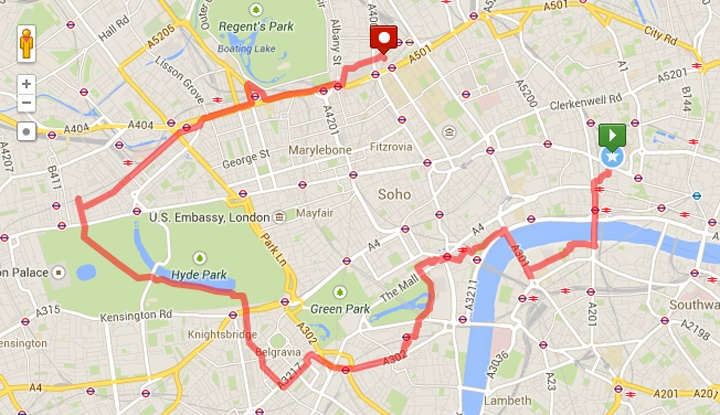
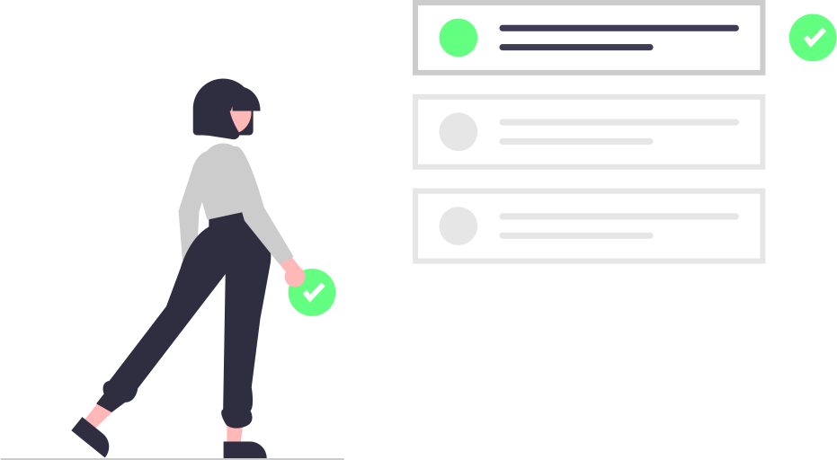

<div align="center">

<!-- 


[](https://github.com/blackphoenix42/Track-Person-App/blob/master/LICENSE) -->


<h3>Track Person App</h3>
<h4>Join official <a href="https://discord.gg/mRUZEhD">Discord Server</a> for discussion.</h4>


</div>

# About

An app that records a person's movements across the map and saves the track on mongodb.

<div align="center">
	
</div>

# 🌱 Quick Start

- Star🌟 and Fork this repository

- Clone this repository remotely.

```sh
git clone https://github.com/blackphoenix42/Track-Person-App.git
```

# Setup

- First, navigate to `./Server` directory to start the server.

- Install the dependencies

```sh
npm install
```

- Open `./.env.EXAMPLE` file in `./Server` directory.

- Add env variables to it and remove the `.EXAMPLE` extension from the file. 

- Run server using:

```sh
npm run dev
```

- Come back to root directory and install the dependencies

```sh
npm install
```

- Start the app

```sh
npm start
```

- Scan the QR Code to run the app in your phone using `expo` application.

<div align="center">
	
</div>

## 🚀 How to Contribute to Project?

- Take a look at the Existing [Issues](https://github.com/blackphoenix42/Track-Person-App/issues) or create your own Issues!
- Check out [CONTRIBUTING.md](./CONTRIBUTING.md)

<div align="center">
	
</div>

## 👾 Project Admin

<table>
	<tr>
		<td align="center">
			<a href="https://github.com/blackphoenix42">
				
				<br /> <sub><b>blackphoenix42</b></sub>
			</a>
			<br /> <a href="https://github.com/blackphoenix42">
		👑 Admin
	    </a>
		</td>
	</tr>
</table>

<!-- ## 🌟 Contributors

<table>
	<tr>
		<td>
			contrib.rocks
			</a>
		</td>
	</tr>
</table> -->
